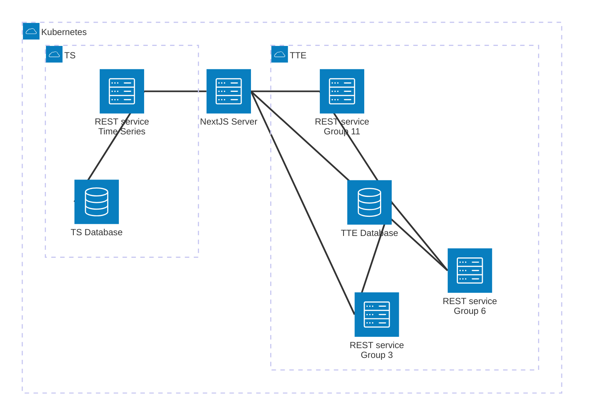

# aSTEP - Integrated Frontend & Documentation

This repository contains the aSTEP project frontend (Next.js) with integrated documentation (Astro/Starlight). The documentation is compiled to static files and served under the `/docs` path.

## 🏗️ Repository Structure

```
aSTEP-frontend/
├── app/                    # Next.js application routes
├── components/             # React components
├── docs/                   # Astro documentation site
│   ├── src/
│   │   └── content/
│   │       └── docs/       # Documentation content (MDX files)
│   │           ├── index.mdx      # Main docs landing page
│   │           ├── cross-group/   # Cross-group collaboration docs
│   │           ├── time-series/   # Time-Series: Outlier Detection & Forecasting
│   │           ├── group-3/       # Group 3: Travel Time Estimation
│   │           ├── group-6/       # Group 6: Attributes Prediction
│   │           └── group-11/      # Group 11: Travel Time Estimation
│   ├── astro.config.mjs    # Astro & sidebar configuration
│   └── package.json        # Docs dependencies
├── public/                 # Static assets
│   └── docs/               # Built documentation (generated)
├── Dockerfile              # Multi-stage build for both apps (docs & frontend)
├── docker-compose.yml      # Docker compose configuration
└── package.json            # Frontend dependencies
```

## 🚀 Getting Started

### Prerequisites

- Node.js 20+
- npm, yarn, pnpm, or bun

### Local Development

1. **Install dependencies:**

```bash
npm install
# or
bun install
```

2. **Run the development server:**

```bash
npm run dev
# or
bun run dev
```

This will:

- Build the documentation site to static files
- Copy the built docs to `public/docs/`
- Start the Next.js development server

3. **Access the application:**
   - Frontend: [http://localhost:3000](http://localhost:3000)
   - Documentation: [http://localhost:3000/docs](http://localhost:3000/docs)

### Development Scripts

| Command | Description |
|---------|-------------|
| `npm run dev` | Build docs and start Next.js dev server |
| `npm run dev:docs` | Start Astro dev server for docs only (port 4321) |
| `npm run build` | Build both docs and Next.js for production |
| `npm run build:docs` | Build docs only (production) |
| `npm run build:docs:dev` | Build docs and copy to public folder (development) |

## 🐳 Docker Deployment

### Using Docker Compose

```bash
docker compose up -d --build
```

This will:

- Build the Astro documentation to static files
- Build the Next.js application with the docs included
- Start the container on port 3000

Access:

- Frontend: <http://localhost:3000>
- Documentation: <http://localhost:3000/docs>

## 📝 Writing Documentation

### For Group Members

1. **Navigate to your group's folder** in `docs/src/content/docs/group-X/`
2. **Create or edit `.md` or `.mdx` files** to document your work
3. **Add images** to `docs/src/assets/` if needed
4. **Update the sidebar** in `docs/astro.config.mjs` to include new pages

### Adding Pages to the Sidebar

Edit `docs/astro.config.mjs` and add items to your group's section:

```javascript
{
  label: 'Group X: Your Topic',
  items: [
    { label: 'Overview', slug: 'group-X' },
    { label: 'Your New Page', slug: 'group-X/your-new-page' },
  ],
}
```

The `slug` should match your file path relative to `docs/src/content/docs/` (without the `.md` extension).

### Documentation Navigation

All documentation links are automatically scoped to the `/docs` path. When you click links in the documentation:

- `/cross-group/` → redirects to `/docs/cross-group/`
- `/group-3/` → redirects to `/docs/group-3/`
- Links within docs work seamlessly

## Deployment Architecture (Coming Soon)

Group 11 is currently working on Kubernetes setup for the project:


```mermaid
architecture-beta
    group ks(cloud)[Kubernetes]
    group tte(cloud)[TTE] in ks
    group ts(cloud)[TS] in ks
    service nextjs(server)[NextJS Server] in ks
    service group11service(server)[REST service Group 11] in tte
    service tsservice(server)[REST service Time Series] in ts
    service group3service(server)[REST service Group 3] in tte
    service group6service(server)[REST service Group 6] in tte
    service ttedatabase(database)[TTE Database] in tte
    service tsdatabase(database)[TS Database] in ts

    group3service:L -- R:ttedatabase
    group6service:L -- R:ttedatabase
    group11service:L -- R:ttedatabase

    group3service:L -- R:nextjs
    group6service:L -- R:nextjs
    group11service:L -- R:nextjs

    tsservice:R -- L:tsdatabase
    tsservice:R -- L:nextjs
```

## 📚 Learn More

- [Next.js Documentation](https://nextjs.org/docs)
- [Astro Documentation](https://docs.astro.build)
- [Starlight Documentation](https://starlight.astro.build)
- [shadcn/ui Documentation](https://ui.shadcn.com/)
