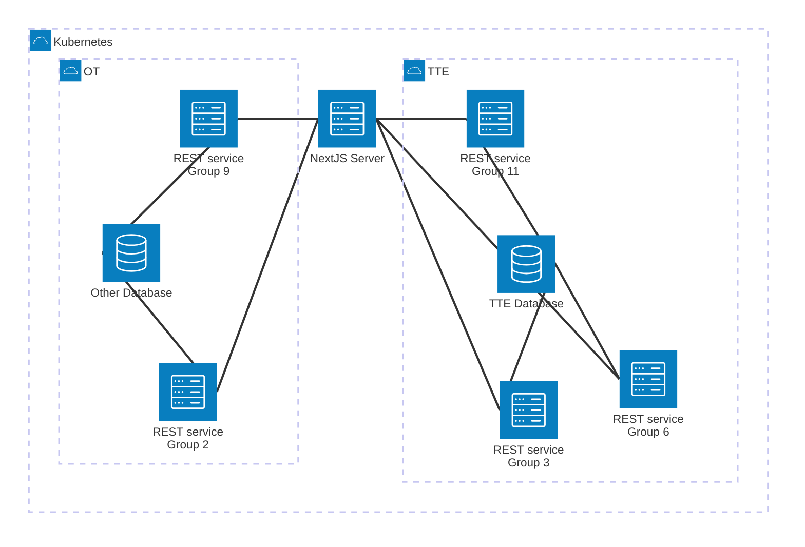

# aSTEP - Frontend

## Getting Started

First install the npm packages:

```bash
npm install
# or
yarn install
# or
pnpm install
# or
bun install
```

Then run the development server:

```bash
npm run dev
# or
yarn dev
# or
pnpm dev
# or
bun dev
```

Open [http://localhost:3000](http://localhost:3000) with your browser to see the result.

You can start editing the page by modifying `app/group**/page.tsx`. The page auto-updates as you edit the file.

This project uses [`next/font`](https://nextjs.org/docs/app/building-your-application/optimizing/fonts) to automatically optimize and load [Geist](https://vercel.com/font), a new font family for Vercel.

## Learn More

To learn more about Next.js or ShadCn, take a look at the following resources:

- [Next.js Documentation](https://nextjs.org/docs) - learn about Next.js features and API.
- [Learn Next.js](https://nextjs.org/learn) - an interactive Next.js tutorial.
- [Shadcn Docs](https://ui.shadcn.com/) - Shadcn Documentation.

You can check out [the Next.js GitHub repository](https://github.com/vercel/next.js) - your feedback and contributions are welcome!

## Deployment coming soon

Group 11 is currently working on kubernetes setup for project


```mermaid
architecture-beta
    group ks(cloud)[Kubernetes]
    group tte(cloud)[TTE] in ks
    group ot(cloud)[OT] in ks
    service nextjs(server)[NextJS Server] in ks
    service group11service(server)[REST service Group 11] in tte 
    service group2service(server)[REST service Group 2] in ot   
    service group3service(server)[REST service Group 3] in tte   
    service group6service(server)[REST service Group 6] in tte   
    service group9service(server)[REST service Group 9] in ot   
    service ttedatabase(database)[TTE Database] in tte
    service otherdatabase(database)[Other Database] in ot

    group3service:L -- R:ttedatabase
    group6service:L -- R:ttedatabase
    group11service:L -- R:ttedatabase

    group3service:L -- R:nextjs
    group6service:L -- R:nextjs
    group11service:L -- R:nextjs

    group2service:R-- L:otherdatabase
    group9service:R -- L:otherdatabase

    group2service:R-- L:nextjs
    group9service:R -- L:nextjs
```

# aSTEP Documentation

This repository contains the documentation for all aSTEP project groups. Each group has their own dedicated section for documenting their work and findings.

## 🏗️ Repository Structure

```
.
├── public/                     # Static assets
├── src/
│   ├── assets/                # Images and other assets
│   ├── content/
│   │   └── docs/
│   │       ├── index.mdx      # Main landing page
│   │       ├── cross-group/   # Cross-group collaboration docs
│   │       ├── group-2/       # Group 2: Forecasting
│   │       ├── group-3/       # Group 3: Travel Time Estimation
│   │       ├── group-6/       # Group 6: Attributes Prediction
│   │       ├── group-9/       # Group 9: Outlier Detection
│   │       └── group-11/      # Group 11: Travel Time Estimation
│   └── content.config.ts
├── astro.config.mjs           # Sidebar Configuration
├── package.json
└── tsconfig.json
```

## 📖 How to Use This Repository

### For Group Members

1. **Navigate to your group's folder**: Go to `src/content/docs/group-X/` where X is your group number
2. **Create documentation files**: Add `.md` or `.mdx` files to document your work
3. **Update your group's index.md**: Keep the main page for your group updated with links to your documentation
4. **Add images**: Place images in `src/assets/` and reference them in your markdown files

### Documentation Structure

Each group should organize their documentation as follows:

- `index.md` - Main page introducing your group's work
- Individual `.md` files for specific topics, algorithms, or findings

### Cross-Group Documentation

Use the `cross-group/` directory for:

- Shared work
- Collaborative findings

### File Organization

- Use descriptive filenames (e.g., `data-preprocessing.md`, `model-architecture.md`)
- Keep files focused on single topics

### Adding Pages to the Sidebar

To add new documentation pages to the website's navigation sidebar:

1. **Edit `astro.config.mjs`** in the root directory
2. **Find your group's section** in the `sidebar` array
3. **Add new items** to your group's `items` array

Example:

```javascript
{
  label: 'Group X: Your Topic',
  items: [
    { label: 'Overview', slug: 'group-X' },
    { label: 'Your New Page', slug: 'group-X/your-new-page' },
  ],
},
```

The `slug` should match your file path relative to `src/content/docs/` (without the `.md` extension).

# Commands

All commands are run from the root of the project, from a terminal:

| Command                   | Action                                           |
| :------------------------ | :----------------------------------------------- |
| `npm install`             | Installs dependencies                            |
| `npm run dev`             | Starts local dev server at `localhost:4321`      |
| `npm run build`           | Build your production site to `./dist/`          |
| `npm run preview`         | Preview your build locally, before deploying     |
| `npm run astro ...`       | Run CLI commands like `astro add`, `astro check` |
| `npm run astro -- --help` | Get help using the Astro CLI                     |
